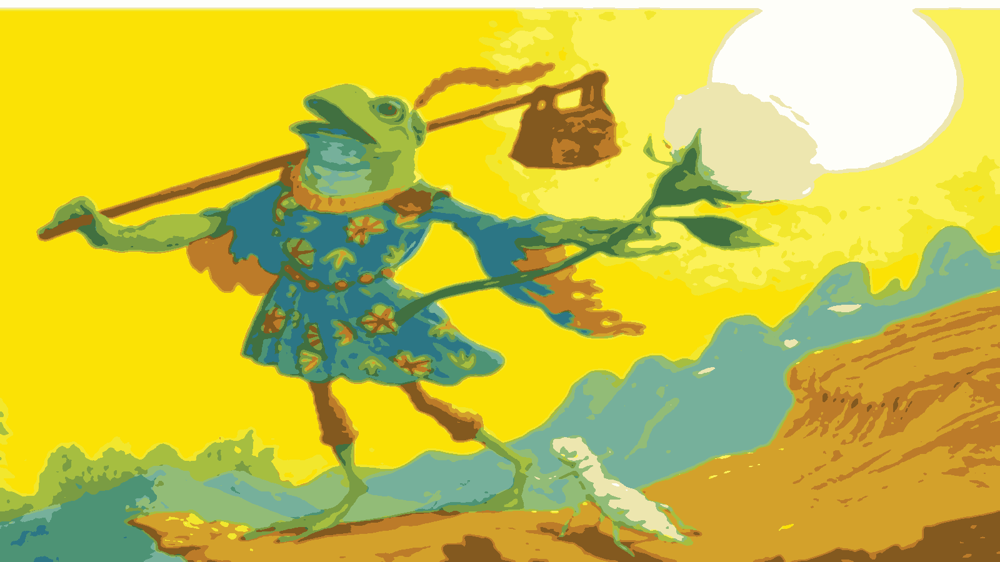
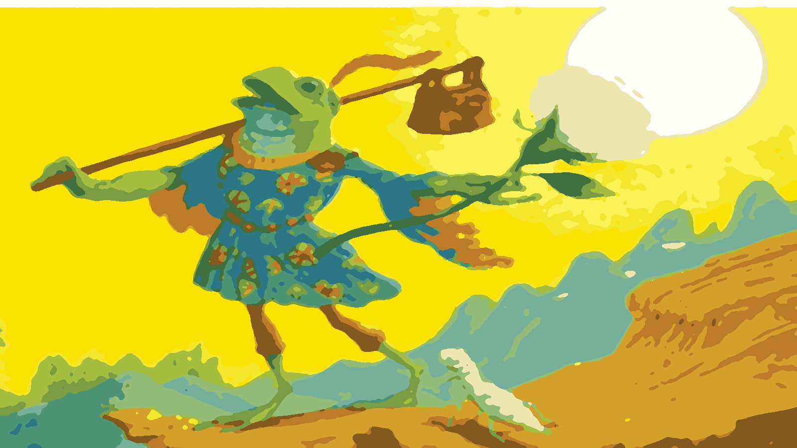
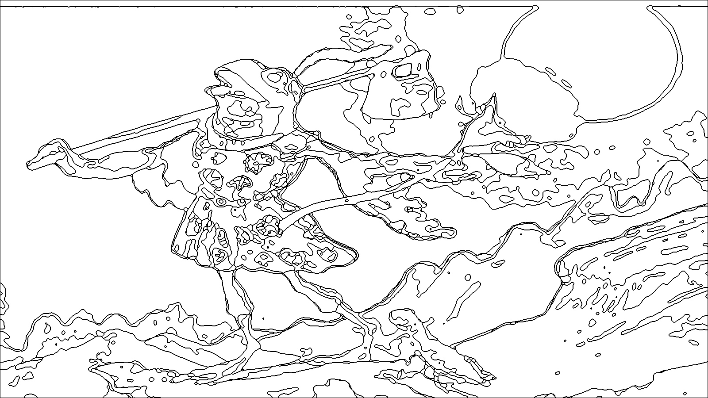
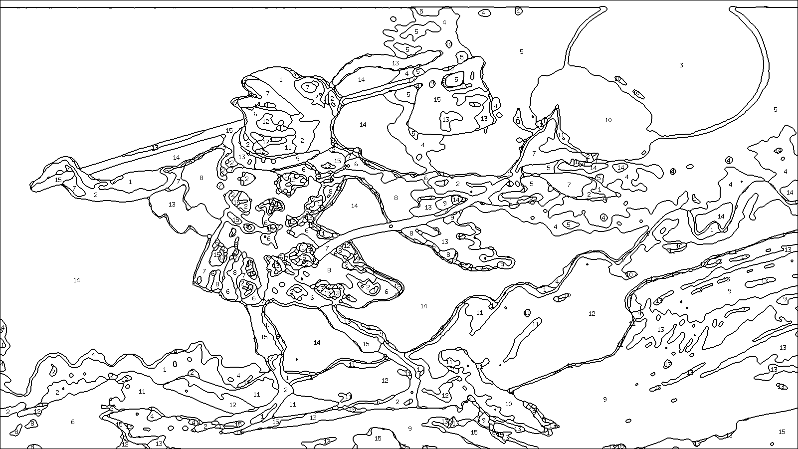

# Go paint by number

Personnal project made for digging more on the algorithmic side of go and some api design.

The app is made to generate painting by number from a photo.

It's made of : 

- An asynchronous HTTP server, serving simple endpoints
- An image processing pipeline
  - Consisting of : 
  - Resizing
  - Gaussian blur for not having too many small zones
  - sub sample
  - a K means implementation to isolate color region
  - a erode & dilate (morphing) implementation to better isolate colors
  - a contouring implementation
  - then a labelling implementation which was more complicated than expected, with flood fill and region center placement for labels

# After resize and blur

# After morphing

# After Contouring

# After labeling

